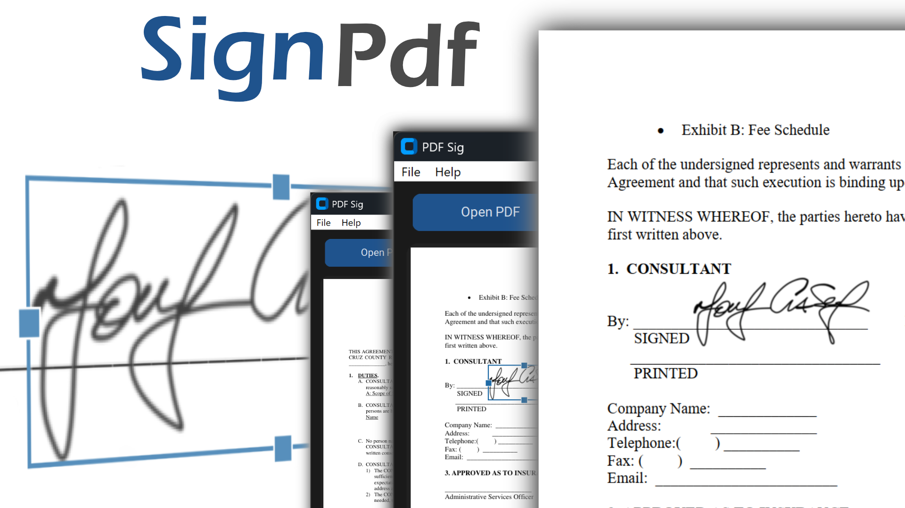

<a name="pdf-sig"></a># Sign PDFs for free



## Downloads 
<table>
  <tr>
    <td>Windows</td>
    <td>Mac</td>
  </tr>
  <tr>
    <td><a href="dist/win/pdf-sig.zip"></a></td>
     <td><a href="dist/mac/pdf_sig-0.1.0.tar.gz"></a></td>
  </tr>
</table>

### Alternative local build
- macOS (Apple Silicon, onedir bundle): `dist/mac/PDF Sig.app` (open via Finder or `open "dist/mac/PDF Sig.app"`).
- Windows: generated by the GitHub Actions **Windows Build** workflow (`.github/workflows/windows-build.yml`); download the `pdf-sig-windows` artifact from the workflow run.

This repo contains a small GUI for loading an existing PDF, dropping an image (e.g., a signature or photo), optionally filling form fields, and saving the result.

## Requirements
- Python 3.10+ (the GUI depends on Tk; install the system Tk/XQuartz libs if they are missing)
- macOS or Windows with a display; headless runs will skip the GUI smoke test

## Setup (dev)
```bash
python -m venv .venv
source .venv/bin/activate       # PowerShell: .venv\Scripts\activate
python -m pip install -r requirements-dev.txt
python -m pip install -e .
```

## Usage (GUI)
After installing the dependencies and activating the virtual environment, launch the Tkinter app:
```bash
pdf_sig
```
Use the top toolbar buttons (**Open PDF**, **Insert Image**, **Save PDF**) to drive the entire flow. When no document is loaded the canvas shows an "open pdf" hint; once opened, the preview automatically fits the window and navigation arrows let you move between pages. After choosing an image, click on the preview to drop it; drag the illuminated side handles to resize the placement, then press **Save PDF** to bake it into the document.

After saving, a confirmation dialog appears with an **Open** button to view the newly saved PDF in your default viewer.

## Tests & quality
- Run unit tests: `python -m pytest -q`
- With coverage: `python -m pytest --cov=src --cov-report=term-missing`
- Enable the GUI smoke test (requires a display/Tk): `ENABLE_GUI_TESTS=1 python -m pytest -q tests/pdf_sig/test_gui_smoke.py`
- Lint/format: `ruff check src tests` and `black src tests`

## Building an executable
After installing the deps above (PyInstaller is not bundled in requirements):
```bash
python -m pip install pyinstaller
pyinstaller -y --distpath dist/mac --workpath build/pdf-sig pdf-sig.spec
```
The resulting bundle appears in `dist/mac/PDF Sig.app` (macOS) with supporting files inside `dist/mac/pdf-sig/`. Remember to copy any template PDFs or assets the executable expects next to it or bake relative paths into your workflow.

### macOS notes
- Build on a Mac to produce a native Mach-O binary. Running PyInstaller on Windows cannot emit a macOS binary.
- After the build finishes, the binaries live in `dist/`; double-clicking the GUI app may show a Gatekeeper warning on unsigned builds. Either right-click → Open once, or codesign with a Developer ID certificate: `codesign --deep --force --sign "Developer ID Application: Your Name" dist/sign-pdf-for-free-gui`.
- The provided `pdf-sig.spec` targets a macOS-friendly onedir bundle and embeds the app icon from `assets/icon/ios`.

### Windows notes
- Build on Windows (or use the provided GitHub Actions workflow) to produce the `.exe` bundle under `dist/win/`.
- Manual build steps on Windows:
  ```powershell
  python -m pip install pyinstaller
  pyinstaller -y --distpath dist/win --workpath build/pdf-sig-win pdf-sig.spec
  ```
- CI build: run the `Windows Build` workflow (`.github/workflows/windows-build.yml`), which uploads the `dist/win` artifacts.
